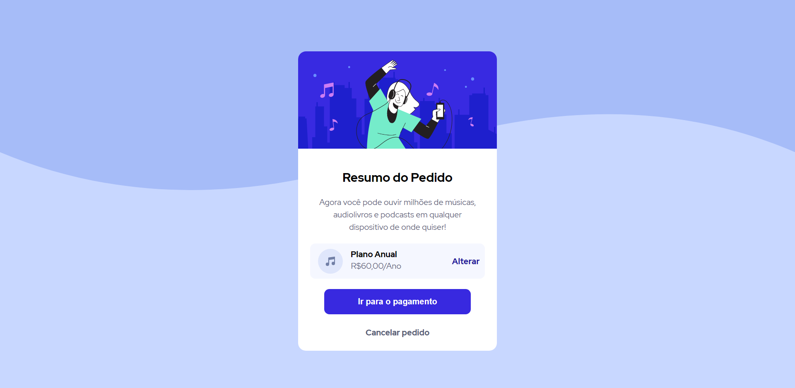

# assinatura-de-musica

  <a href="">Acesse o site</a>&nbsp;&nbsp;&nbsp;|&nbsp;&nbsp;&nbsp;
  <a href="#-tecnologias">Tecnologias</a>&nbsp;&nbsp;&nbsp;|&nbsp;&nbsp;&nbsp;
  <a href="#-projeto">Projeto</a>&nbsp;&nbsp;&nbsp;|&nbsp;&nbsp;&nbsp;

 

  

## 🚀 Tecnologias

Esse projeto foi desenvolvido com as seguintes tecnologias:

- HTML
- CSS

## 💻 Projeto

É uma página estatica proposta originalmente pelo desafio do Frontend Mentor.<a target="_blank" href="https://www.frontendmentor.io/challenges/order-summary-component-QlPmajDUj">Veja aqui</a>

## 📱 Versão mobile

  

